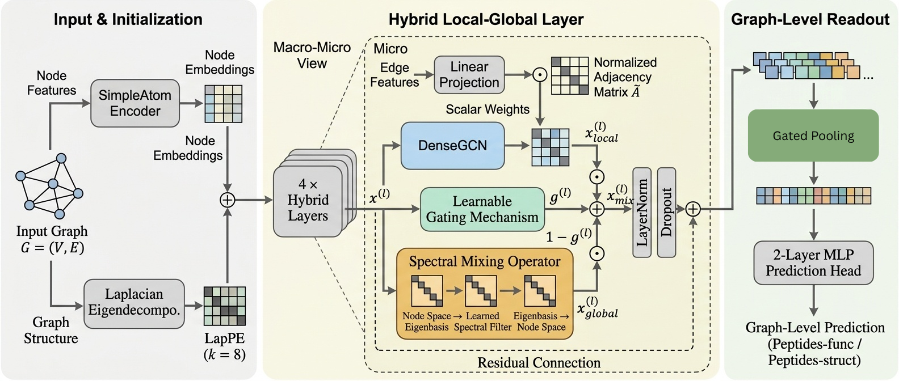

# GraphFNet: Attention-Free Graph Learning via Learned Spectral-Local Gating

Official research repository for **GraphFNet**, an attention-free graph neural network architecture that replaces the quadratic memory footprint of dense self-attention with learned global spectral mixing over the graph Laplacian eigenbasis, adaptively gated with local message passing.

<p align="center">
  
</p>

---

## 📁 Repository Structure

```
.
├── figures/                                # Architecture diagrams & benchmark plots
│   ├── methodology_picture.png             # GraphFNet architecture diagram
│   ├── exp1_isolated_global_branch.png     # Isolated global branch VRAM scaling
│   ├── exp2_eigendecomp_cost.png           # Eigendecomposition precomputation scaling
│   ├── exp3_full_sparse_models.png         # Full 4-layer model peak VRAM scaling
│   ├── erf_func.png / erf_struct.png       # Effective Receptive Field (ERF) heatmaps
│   ├── k_sensitivity.png                   # LapPE k-sensitivity analysis
│   └── neighbors_match_results.png         # Tree-NeighborsMatch diagnostic results
│
├── notebooks/                              # Benchmark & evaluation experiments
│   ├── 01_peptides_func.ipynb              # LRGB Peptides-func multi-label classification
│   ├── 02_peptides_struct.ipynb            # LRGB Peptides-struct 3D regression
│   ├── 03_hcp_gender.ipynb                 # NeuroGraph HCP-Gender connectome classification (N=1000)
│   ├── 04_hcp_task.ipynb                   # NeuroGraph HCP-Task 7-class cognitive state classification
│   ├── 05_pascalvoc_sp.ipynb               # PascalVOC-SP superpixel node segmentation
│   ├── 06_bbbp_transferability.ipynb       # MoleculeNet BBBP scaffold split transferability
│   ├── 07_ablations.ipynb                  # Full architectural ablation studies
│   ├── 08_gate_analysis.ipynb              # Emergent layer-wise spectral-to-local routing analysis
│   ├── 09_neighbors_match.ipynb            # Tree-NeighborsMatch over-squashing diagnostic
│   └── 10_vram_scaling_benchmark.ipynb     # Memory & throughput scaling benchmarks
│
├── scripts/                                # Standalone diagnostic & analysis scripts
│   ├── erf_analysis.py                     # Effective Receptive Field (ERF) diagnostic
│   ├── pascalvoc_sp_diagnostics.py         # PascalVOC class imbalance & boundary analysis
│   └── k_sensitivity.py                    # Laplacian eigenvector k-sensitivity evaluation
│
├── requirements.txt                        # Python dependencies
├── .gitignore                              # Clean repository ignore rules
└── README.md                               # Project documentation
```

---

## 🚀 Key Results & Highlights

- **Attention-Free Efficiency**: Replaces dynamic $\mathcal{O}(N^2)$ self-attention with static spectral projections ($\mathcal{O}(N \cdot H)$ activation memory), achieving up to **$102.7\times$** memory reduction for isolated global branches at $N=10{,}000$ and **$3.78\times$** full-model reduction at $N=5{,}000$.
- **NeuroGraph Connectomics ($N=1{,}000$)**:
  - **HCP-Gender**: **81.17% ± 1.90%** test accuracy (State-of-the-Art; outperforming GraphGPS at 76.85%, Graph-Mamba at 77.16%, and BrainMAP at 78.92%).
  - **HCP-Task**: **93.74% ± 0.54%** test accuracy across 7 cognitive task states.
- **LRGB Peptides**:
  - Competitive with Graph Transformers (0.6244 AP on Peptides-func, 0.2663 MAE on Peptides-struct) while utilizing **$\sim$35% fewer parameters** (329k vs. 500k budget) and $<250$ MB peak memory.
- **Emergent Interpretability**: Autonomously learns a spectral-to-local routing curriculum across layers (early layers capture global topology; later layers refine local chemistry).

---

## 🛠️ Installation & Environment Setup

```bash
# Clone the repository
git clone https://github.com/Rogue-05/GraphFNet-Attention-Free-Graph-Learning-via-Learned-Spectral-Local-Gating.git
cd GraphFNet-Attention-Free-Graph-Learning-via-Learned-Spectral-Local-Gating

# Create and activate conda environment
conda create -n graphfnet python=3.10 -y
conda activate graphfnet

# Install PyTorch & PyTorch Geometric
pip install torch torchvision --index-url https://download.pytorch.org/whl/cu118
pip install torch_geometric

# Install additional requirements
pip install -r requirements.txt
```
